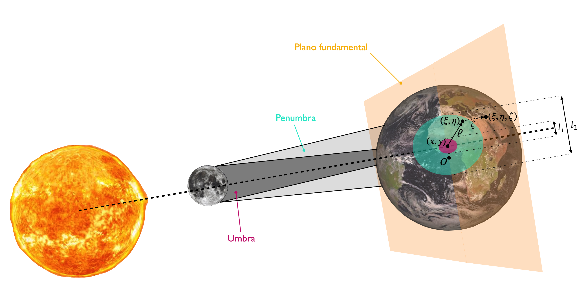
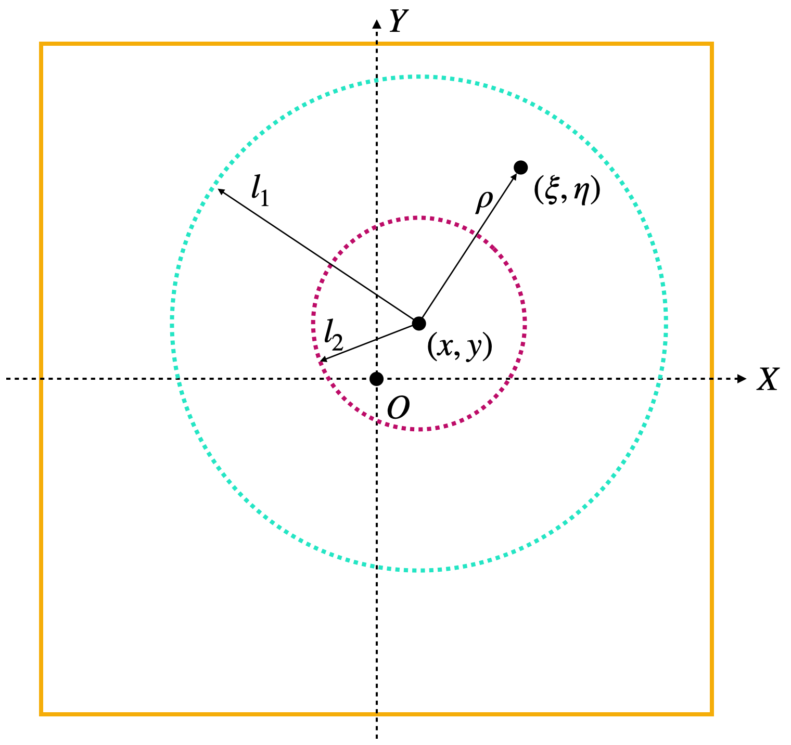
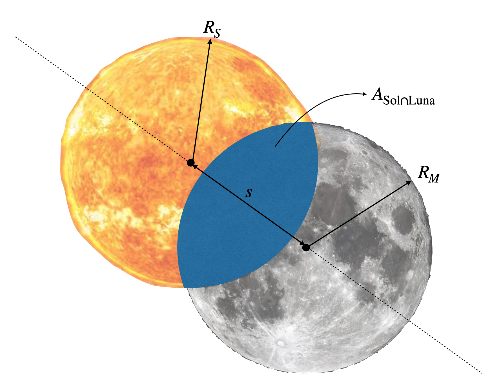
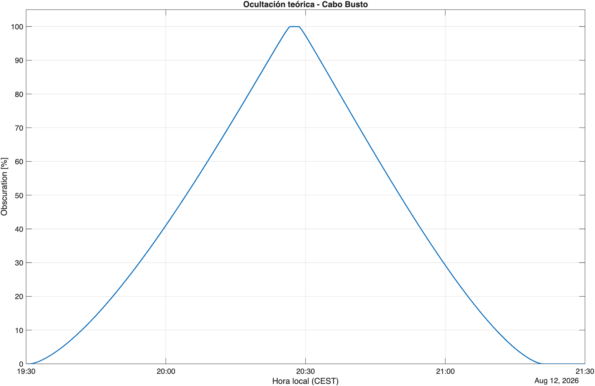

# Modelado teórico del eclipse

Este documento describe el modelo matemático utilizado para reconstruir las circunstancias locales del eclipse solar total del **12 de agosto de 2026** y calcular la fracción del disco solar ocultada en función del tiempo para un observador situado en **Cabo Busto, Asturias (España)**.

El modelo parte de los **elementos besselianos publicados por NASA/GSFC** y realiza las siguientes etapas:

1. Evaluación temporal de los elementos besselianos.
2. Transformación de la posición geográfica del observador al sistema de coordenadas besseliano.
3. Cálculo de la geometría local del eje y de los conos de sombra.
4. Reconstrucción de la geometría aparente Sol-Luna.
5. Cálculo del área de intersección de ambos discos aparentes.
6. Obtención de la fracción de ocultación del disco solar.

El objetivo de este proyecto no es generar las efemérides astronómicas desde cero, sino reconstruir las circunstancias locales del eclipse a partir de los elementos besselianos proporcionados por NASA/GSFC.

---

## 1. Elementos besselianos

Los elementos besselianos permiten representar la geometría de un eclipse solar mediante un conjunto reducido de parámetros dependientes del tiempo.

En lugar de resolver directamente la geometría tridimensional Sol-Luna-Tierra para cada observador, el método describe la posición y dimensiones de la sombra lunar en un sistema de referencia asociado al eje de dicha sombra.

Los principales elementos utilizados son:

| Elemento | Descripción |
|---|---|
| `x` | Primera coordenada del eje de la sombra sobre el plano fundamental |
| `y` | Segunda coordenada del eje de la sombra sobre el plano fundamental |
| `d` | Declinación del eje de la sombra |
| `μ` | Ángulo horario besseliano |
| `l1` | Radio de la penumbra sobre el plano fundamental |
| `l2` | Radio de la umbra sobre el plano fundamental |
| `tan(f1)` | Apertura del cono de penumbra |
| `tan(f2)` | Apertura del cono de umbra |

NASA/GSFC proporciona los elementos mediante coeficientes polinómicos alrededor de un instante de referencia $t_0$.

Para cada elemento $a$:

$$
a(t)=a_0+a_1t+a_2t^2+a_3t^3
$$

donde $t$ representa el número de **horas transcurridas respecto al instante de referencia**.

Para el eclipse del 12 de agosto de 2026:

$$
t_0 = 18.000\ \mathrm{TT}
$$

Los coeficientes utilizados en este proyecto son:

| $n$ | $x$ | $y$ | $d$ | $l_1$ | $l_2$ | $\mu$ |
|---:|---:|---:|---:|---:|---:|---:|
| 0 | 0.4755140 | 0.7711830 | 14.7966700 | 0.5379550 | -0.0081420 | 88.747787 |
| 1 | 0.5189249 | -0.2301680 | -0.0120650 | 0.0000939 | 0.0000935 | 15.003090 |
| 2 | -0.0000773 | -0.0001246 | -0.0000030 | -0.0000121 | -0.0000121 | 0 |
| 3 | -0.0000080 | 0.0000038 | 0 | 0 | 0 | 0 |

Además:

$$
\tan f_1=0.0046141
$$

$$
\tan f_2=0.0045911
$$

y NASA/GSFC especifica:

$$
\Delta T = 75.4\ \mathrm{s}
$$

> **Nota:** los elementos besselianos constituyen los datos de entrada del modelo y no son calculados en este repositorio. Su procedencia es NASA/GSFC.

En MATLAB, la evaluación temporal de estos elementos se implementa en:

```text
src/evaluateBesselElements.m
```

Los coeficientes se almacenan en orden compatible con `polyval`.

---

## 2. Sistemas temporales

El modelado de un eclipse requiere distinguir entre diferentes escalas temporales.

En este proyecto aparecen principalmente **UTC, UT1 y TT**.

### 2.1 UTC

UTC (*Coordinated Universal Time*) es la escala temporal utilizada para expresar los instantes del eclipse desde el punto de vista del usuario.

Las horas del vídeo y los resultados finales se representan inicialmente en esta escala o en hora civil local.

### 2.2 UT1

UT1 está asociado a la rotación real de la Tierra.

Es la escala temporal relevante cuando es necesario relacionar un instante con la orientación terrestre.

UTC y UT1 se relacionan mediante:

$$
UT1 = UTC + DUT1
$$

donde $DUT1$ representa la diferencia entre ambas escalas.

### 2.3 TT

TT (*Terrestrial Time*) es una escala temporal uniforme utilizada en los cálculos astronómicos.

NASA define los elementos besselianos del eclipse respecto a TT. Por tanto, para evaluar correctamente sus polinomios es necesario expresar el instante en esta escala.

La diferencia:

$$
\Delta T = TT-UT1
$$

para este eclipse es:

$$
\Delta T=75.4\ \mathrm{s}
$$

En el proyecto, las transformaciones temporales se encapsulan mediante:

```text
src/utc2TT.m
src/tt2UTC.m
```

La precisión temporal constituye una de las aproximaciones del modelo y se discute posteriormente en la sección de limitaciones.

---

## 3. Sistema de coordenadas besseliano

La principal ventaja del método besseliano es transformar la geometría tridimensional del eclipse en un problema mucho más manejable.

Se define un sistema de referencia asociado al **eje de la sombra lunar**.

El plano fundamental es perpendicular a dicho eje, y sobre él se expresan tanto la posición de la sombra como la proyección del observador.

Las coordenadas:

$$
(x,y)
$$

describen la intersección del eje de la sombra con el plano fundamental.

Por otra parte:

$$
(\xi,\eta,\zeta)
$$

describen la posición del observador en el sistema besseliano.

- $\xi$ y $\eta$ representan las componentes proyectadas sobre el plano fundamental.
- $\zeta$ representa la componente paralela al eje de la sombra.

Todas estas distancias se expresan normalizadas respecto al radio ecuatorial terrestre.



Una vez expresados el eje de la sombra y el observador en el mismo sistema de referencia, el problema local del eclipse se reduce considerablemente.

---

## 4. Modelo de la Tierra y posición del observador

El observador se especifica inicialmente mediante sus coordenadas geodésicas:

$$
(\varphi,\lambda,h)
$$

donde:

- $\varphi$ es la latitud geodésica.
- $\lambda$ es la longitud geográfica.
- $h$ es la altura sobre el elipsoide de referencia.

En este proyecto se utiliza el elipsoide **WGS84**.

### 4.1 Parámetros WGS84

El semieje mayor es:

$$
a=6378137.0\ \mathrm{m}
$$

y el achatamiento:

$$
f=\frac{1}{298.257223563}
$$

La primera excentricidad al cuadrado viene dada por:

$$
e^2=f(2-f)
$$

### 4.2 Radio de curvatura

Para una latitud geodésica $\varphi$, el radio de curvatura del primer vertical es:

$$
N=
\frac{a}
{\sqrt{1-e^2\sin^2\varphi}}
$$

A partir de él se obtienen las componentes geocéntricas normalizadas del observador:

$$
\rho\cos\varphi'=
\frac{N+h}{a}\cos\varphi
$$

$$
\rho\sin\varphi'=
\frac{N(1-e^2)+h}{a}\sin\varphi
$$

Estas expresiones permiten tener en cuenta el achatamiento terrestre en lugar de aproximar la Tierra mediante una esfera perfecta.

---

## 5. Coordenadas besselianas del observador

Una vez conocida la posición geocéntrica del observador, esta debe rotarse al sistema de referencia asociado al eclipse.

Se define el ángulo horario local:

$$
H=\mu+\lambda
$$

utilizando la convención:

$$
\lambda>0 \quad \text{hacia el este}
$$

$$
\lambda<0 \quad \text{hacia el oeste}
$$

Las coordenadas besselianas del observador son entonces:

$$
\xi=
\rho\cos\varphi'\sin H
$$

$$
\eta=
\rho\sin\varphi'\cos d
-
\rho\cos\varphi'\cos H\sin d
$$

$$
\zeta=
\rho\sin\varphi'\sin d
+
\rho\cos\varphi'\cos H\cos d
$$

La implementación correspondiente se encuentra en:

```text
src/observerBesselCoordinates.m
```

Con esta transformación, la posición del observador y la posición del eje de la sombra quedan expresadas en el mismo sistema de coordenadas.

---

## 6. Geometría local de la sombra

Los elementos $x$ e $y$ indican la posición del eje de la sombra sobre el plano fundamental.

El observador se encuentra en:

$$
(\xi,\eta)
$$

Por tanto, la separación entre ambos sobre dicho plano puede escribirse como:

$$
u=x-\xi
$$

$$
v=y-\eta
$$

y la distancia transversal al eje de la sombra es:

$$
\rho=\sqrt{u^2+v^2}
$$

### 6.1 Radio local de la penumbra

El radio de la penumbra debe corregirse en función de la coordenada $\zeta$ del observador:

$$
L_1=l_1-\zeta\tan f_1
$$

### 6.2 Radio local de la umbra

De forma análoga:

$$
L_2=l_2-\zeta\tan f_2
$$

Estas magnitudes permiten determinar la posición del observador respecto a los conos de sombra.

En particular, durante un eclipse total:

$$
\rho < |L_2|
$$

indica que el observador se encuentra dentro de la umbra.

Los contactos interiores C2 y C3 aparecen cuando:

$$
\boxed{\rho=|L_2|}
$$

Es decir, cuando la posición proyectada del observador cruza el límite local de la umbra.

La implementación de esta parte se encuentra en:

```text
src/localEclipseGeometry.m
```



---

## 7. Geometría aparente Sol-Luna

La geometría besseliana permite determinar si un observador se encuentra dentro o fuera de la sombra, pero para calcular la **fracción del disco solar ocultada** es necesario reconstruir la geometría aparente del Sol y la Luna.

Desde el punto de vista del observador, ambos cuerpos se modelan mediante dos discos caracterizados por:

- Radio aparente del Sol:

$$
R_S
$$

- Radio aparente de la Luna:

$$
R_M
$$

- Separación aparente entre sus centros:

$$
s
$$

La implementación correspondiente se encuentra en:

```text
src/apparentSunMoonGeometry.m
```

El resultado permite transformar el problema del eclipse en un problema geométrico sencillo: calcular el área de intersección de dos círculos.



---

## 8. Fracción de ocultación del disco solar

Se define la fracción de ocultación como:

$$
O=
\frac{A_{\mathrm{oculta}}}
     {A_{\mathrm{Sol}}}
$$

donde:

$$
A_{\mathrm{Sol}}=\pi R_S^2
$$

y $A_{\mathrm{oculta}}$ corresponde al área de intersección entre los discos aparentes del Sol y la Luna.

Por definición:

$$
0\leq O\leq1
$$

donde:

- $O=0$: el disco solar no está ocultado.
- $O=1$: el disco solar está completamente ocultado.
- $0<O<1$: eclipse parcial.

### 8.1 Sin intersección

Si:

$$
s\geq R_S+R_M
$$

los discos no se intersectan y:

$$
O=0
$$

### 8.2 Ocultación total

Si el disco solar se encuentra completamente contenido dentro del disco lunar:

$$
s+R_S\leq R_M
$$

entonces:

$$
O=1
$$

### 8.3 Intersección parcial

Para el caso general de intersección parcial, el área común entre dos círculos viene dada por:

$$
\begin{aligned}
A={}&
R_S^2
\cos^{-1}
\left(
\frac{s^2+R_S^2-R_M^2}
     {2sR_S}
\right)
\\
&+
R_M^2
\cos^{-1}
\left(
\frac{s^2+R_M^2-R_S^2}
     {2sR_M}
\right)
\\
&-
\frac{1}{2}
\sqrt{
(-s+R_S+R_M)
(s+R_S-R_M)
(s-R_S+R_M)
(s+R_S+R_M)
}
\end{aligned}
$$

Finalmente:

$$
\boxed{
O=
\frac{A}
     {\pi R_S^2}
}
$$

La función encargada de resolver la intersección geométrica es:

```text
src/circleOverlapFraction.m
```

y el cálculo completo de la fracción de ocultación en función del tiempo se encapsula en:

```text
src/theoreticalEclipseObscuration.m
```

Por tanto, el flujo completo puede resumirse como:

$$
\text{Elementos besselianos}
$$

$$
\downarrow
$$

$$
\text{Posición besseliana del observador}
$$

$$
\downarrow
$$

$$
\text{Geometría local de la sombra}
$$

$$
\downarrow
$$

$$
\text{Geometría aparente Sol-Luna}
$$

$$
\downarrow
$$

$$
\text{Intersección de los discos}
$$

$$
\downarrow
$$

$$
\boxed{O(t)}
$$

---

## 9. Aplicación a Cabo Busto

Para el experimento se utilizó una posición aproximada del observador en Cabo Busto:

$$
\varphi=43.5628^\circ
$$

$$
\lambda=-6.4737^\circ
$$

$$
h\approx60\ \mathrm{m}
$$

donde se utiliza la convención de longitud positiva hacia el este y negativa hacia el oeste.

Para cada instante $t$, el modelo:

1. Evalúa los elementos besselianos.
2. Calcula las coordenadas besselianas del observador.
3. Obtiene la geometría local de la sombra.
4. Reconstruye los discos aparentes del Sol y de la Luna.
5. Calcula su área de intersección.
6. Devuelve la fracción de ocultación $O(t)$.

El resultado es una señal temporal que describe la evolución teórica del eclipse para la posición del observador.



Esta señal constituye la referencia teórica utilizada posteriormente para comparar el eclipse predicho con la evolución de la luminancia registrada por la cámara.

El procesamiento del vídeo se describe en:

[Procesamiento de imagen](procesamiento-imagen.md)

---

## 10. Cálculo de los contactos

Los contactos del eclipse pueden obtenerse a partir de las condiciones geométricas de los discos aparentes o de los límites de los conos de sombra.

Para los contactos interiores C2 y C3, la condición utilizada en el modelo besseliano es:

$$
\rho-|L_2|=0
$$

Las raíces de esta ecuación se obtienen numéricamente mediante `fzero`.

Antes de C2:

$$
\rho>|L_2|
$$

Durante la totalidad:

$$
\rho<|L_2|
$$

Después de C3:

$$
\rho>|L_2|
$$

De forma equivalente, en términos de geometría aparente, C2 y C3 corresponden a la tangencia interior de los discos solar y lunar.

---

## 11. Validación del modelo

La implementación se validó en diferentes niveles antes de utilizarla para analizar el vídeo.

### 11.1 Evaluación de los elementos en $t_0$

Al evaluar los polinomios exactamente en:

$$
t=t_0
$$

deben recuperarse los coeficientes de orden cero publicados por NASA/GSFC.

Se verificó numéricamente:

| Elemento | Esperado |
|---|---:|
| $x$ | 0.4755140 |
| $y$ | 0.7711830 |
| $d$ | 14.7966700 |
| $l_1$ | 0.5379550 |
| $l_2$ | -0.0081420 |
| $\mu$ | 88.747787 |

El test reproduce estos valores dentro de la tolerancia numérica especificada.

### 11.2 Conversión temporal

NASA/GSFC publica para el máximo global aproximadamente:

$$
17{:}45{:}51\ \mathrm{UT}
$$

Utilizando:

$$
\Delta T=75.4\ \mathrm{s}
$$

se obtiene:

$$
17{:}47{:}06.4\ \mathrm{TT}
$$

coherente con el instante publicado por NASA/GSFC.

### 11.3 Geometría local

Se verificó que durante la totalidad:

$$
\rho<|L_2|
$$

mientras que en las proximidades de C2 y C3:

$$
\rho\approx|L_2|
$$

confirmando cualitativamente el comportamiento esperado de la geometría local.

### 11.4 Validación de los contactos

Los tiempos calculados se compararon con las circunstancias locales proporcionadas por el mapa de eclipses de NASA/GSFC.

La comparación mostró diferencias temporales del orden de **unos pocos segundos**, con errores máximos observados inferiores a aproximadamente **8 segundos** en los contactos analizados.

Estas diferencias son pequeñas respecto a la escala temporal del experimento y permiten utilizar el modelo como referencia para sincronizar la predicción teórica con el timelapse.

> Este modelo no pretende sustituir las herramientas oficiales de predicción astronómica de NASA/GSFC. La comparación se utiliza como validación independiente de la implementación y muestra una precisión suficiente para los objetivos experimentales de este proyecto.

Los tests utilizados para validar la implementación se encuentran en:

```text
tests/
```

---

## 12. Limitaciones

El modelo desarrollado presenta una serie de limitaciones que deben tenerse en cuenta al interpretar los resultados.

### 12.1 Elementos besselianos externos

Las efemérides y los elementos besselianos no se calculan desde cero.

El modelo utiliza como entrada los elementos publicados por NASA/GSFC, generados a partir de modelos astronómicos de mayor precisión.

Por tanto, el objetivo del repositorio es reconstruir las **circunstancias locales** a partir de dichos elementos, no reproducir el cálculo completo de las efemérides Sol-Luna.

### 12.2 Sistemas temporales

La relación entre UTC, UT1 y TT requiere conocer las diferencias entre estas escalas temporales.

En este eclipse se utiliza el valor:

$$
\Delta T=75.4\ \mathrm{s}
$$

publicado por NASA/GSFC.

Las aproximaciones realizadas en el tratamiento temporal contribuyen al error final en los tiempos de contacto.

### 12.3 Posición del observador

Las coordenadas y altura utilizadas para Cabo Busto son aproximadas.

Pequeñas variaciones de posición pueden producir diferencias en los tiempos locales de contacto, especialmente cerca de los límites de la trayectoria de totalidad.

### 12.4 Precisión del modelo

La implementación está orientada a un experimento de análisis y visualización, no a la generación de efemérides astronómicas de alta precisión.

La validación frente a NASA/GSFC muestra errores temporales de pocos segundos, considerados suficientes para sincronizar el modelo con el vídeo utilizado en el experimento.

---

## 13. Implementación

La implementación MATLAB del modelo se encuentra en la carpeta:

```text
src/
```

Las principales funciones son:

| Función | Propósito |
|---|---|
| `evaluateBesselElements` | Evalúa los elementos besselianos para un instante determinado |
| `observerBesselCoordinates` | Transforma la posición geográfica del observador al sistema besseliano |
| `localEclipseGeometry` | Calcula la geometría local de la sombra |
| `apparentSunMoonGeometry` | Obtiene la geometría aparente de los discos solar y lunar |
| `circleOverlapFraction` | Calcula la fracción de área común entre dos círculos |
| `theoreticalEclipseObscuration` | Calcula la fracción teórica de ocultación en función del tiempo |
| `utc2TT` | Realiza la conversión temporal utilizada entre UTC y TT |
| `tt2UTC` | Realiza la conversión inversa entre TT y UTC |

El script:

```text
main.m
```

combina el modelo teórico con el procesamiento experimental del timelapse y genera la visualización final.

---

## 14. Referencias

### NASA/GSFC

Los elementos besselianos utilizados en este proyecto proceden de las predicciones de eclipses solares de NASA/GSFC para:

**Total Solar Eclipse of 2026 August 12**

Los datos utilizados fueron generados para el centro de masas de la Luna mediante las efemérides **VSOP87/ELP2000-82**, utilizando:

$$
\Delta T=75.4\ \mathrm{s}
$$

NASA Eclipse Web Site / Goddard Space Flight Center:

https://eclipse.gsfc.nasa.gov/

### Five Millennium Canon of Solar Eclipses

NASA/GSFC:

*Five Millennium Canon of Solar Eclipses: -1999 to +3000.*

https://eclipse.gsfc.nasa.gov/SEpubs/5MCSE.html

---

## Autor

**Alfredo Rodríguez Magdalena**

© 2026 Alfredo Rodríguez Magdalena

El código desarrollado en este repositorio se distribuye bajo los términos indicados en el archivo [`LICENSE`](../LICENSE).

Los elementos besselianos y datos astronómicos procedentes de NASA/GSFC se identifican expresamente como datos externos y no constituyen trabajo original del autor.