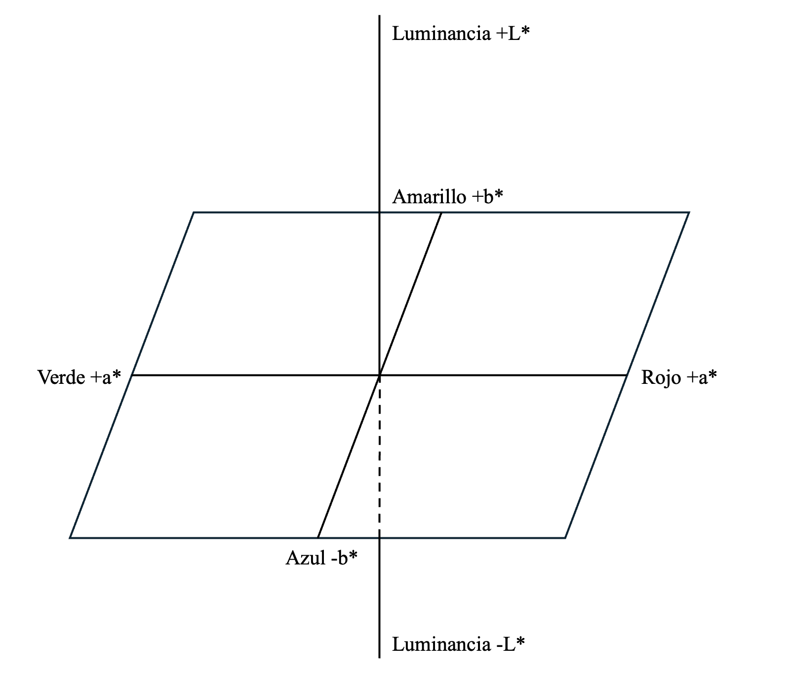
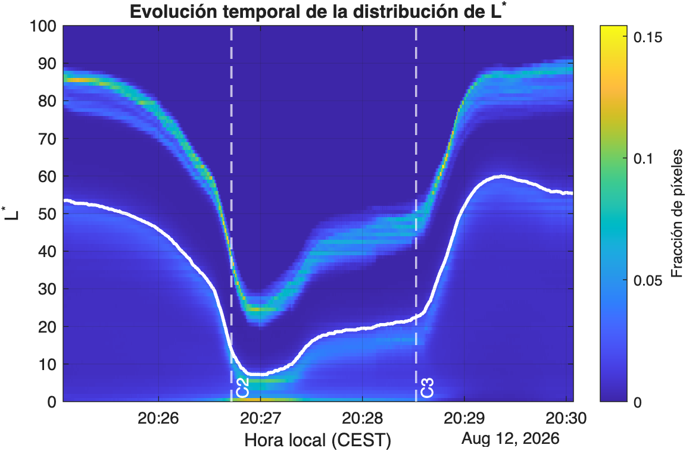
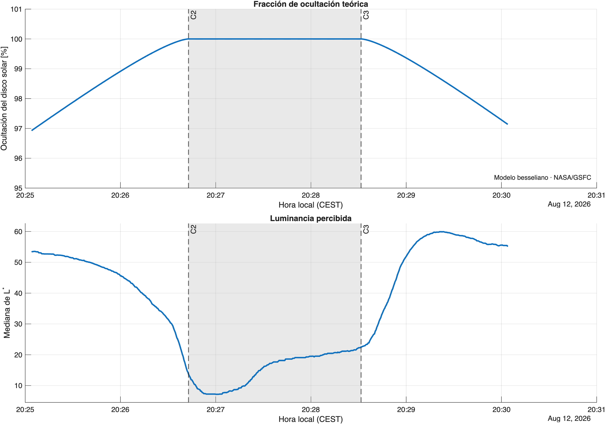

# Procesamiento de imagen

Este documento describe el procesamiento aplicado al timelapse grabado durante el eclipse solar total del **12 de agosto de 2026** desde **Cabo Busto, Asturias (España)**.

El objetivo es obtener, a partir del vídeo, una señal que permita estudiar la evolución de la luminosidad aparente de la escena y compararla temporalmente con la fracción de ocultación calculada mediante el [modelo teórico del eclipse](modelo-teorico.md).

El procesamiento sigue las siguientes etapas:

1. Lectura del vídeo frame a frame.
2. Sincronización de cada frame con el instante real del eclipse.
3. Transformación del espacio de color RGB a CIELAB.
4. Extracción del canal $L^*$.
5. Análisis de la distribución de $L^*$ de cada frame.
6. Obtención de un estadístico representativo de la escena.
7. Comparación temporal con la fracción de ocultación teórica.

El flujo completo puede resumirse como:

$$
\text{Timelapse}
\rightarrow
\text{Frames RGB}
\rightarrow
\text{CIELAB}
\rightarrow
L^*
\rightarrow
\text{Estadístico temporal}
$$

$$
\downarrow
$$

$$
\boxed{L^*(t)}
$$

---

## 1. Adquisición del vídeo

El vídeo utilizado en el experimento fue grabado durante las proximidades de la totalidad desde Cabo Busto.

La grabación se realizó mediante el **timelapse** de un iPhone 17 Pro Max, por lo que el tiempo de reproducción del vídeo no coincide con el tiempo real transcurrido durante el eclipse.

En este caso se utilizó un factor de aceleración:

$$
F=15
$$

por lo que:

$$
1\ \mathrm{s\ de\ vídeo}
=
15\ \mathrm{s\ reales}
$$

El comienzo del vídeo se sincronizó con la hora local:

$$
20{:}25{:}04\ \mathrm{CEST}
$$

del 12 de agosto de 2026.

> El vídeo no cubre la totalidad del eclipse desde C1 hasta C4. La grabación se concentra alrededor de la fase de totalidad y sus proximidades.

---

## 2. Sincronización temporal

Para comparar la grabación con el modelo astronómico es necesario asociar cada frame del timelapse con el instante real en el que fue capturado.

Si $t_v$ representa el tiempo de reproducción del vídeo y $F$ el factor de aceleración del timelapse:

$$
\Delta t_{\mathrm{real}}=F\,t_v
$$

Por tanto, el instante real asociado a cada frame se obtiene mediante:

$$
t_{\mathrm{local}}
=
t_{\mathrm{inicio}}
+
F\,t_v
$$

En MATLAB:

```matlab
timeLapseFactor = 15;

tVideoStartLocal = datetime(2026,8,12,20,25,4);

tVideoLocal = tVideoStartLocal ...
    + seconds(videoData.time * timeLapseFactor);
```

Dado que el eclipse ocurrió durante el horario de verano de España peninsular:

$$
CEST = UTC + 2\ \mathrm{h}
$$

y, por tanto:

```matlab
tVideoUT = tVideoLocal - hours(2);
```

Esto permite evaluar el modelo teórico exactamente en los instantes correspondientes a los frames del vídeo:

```matlab
ObsVideo = theoreticalEclipseObscuration( ...
    lat, lon, h, ...
    tVideoUT, eclipseData);
```

De esta forma quedan sincronizadas las dos señales principales del experimento:

$$
O(t)
$$

fracción teórica del disco solar ocultado, y

$$
L^*(t)
$$

indicador obtenido experimentalmente a partir del vídeo.

---

## 3. ¿Por qué no trabajar directamente en RGB?

Cada frame del vídeo se encuentra originalmente representado mediante tres canales:

$$
R,\quad G,\quad B
$$

El espacio RGB es adecuado para representar imágenes, pero sus componentes no proporcionan directamente una magnitud sencilla asociada a la claridad percibida de la escena.

Por ejemplo, dos colores distintos pueden presentar combinaciones muy diferentes de $R$, $G$ y $B$ y, sin embargo, ser percibidos con una claridad similar.

Para separar mejor la información relacionada con la claridad de la información cromática, los frames se transforman al espacio de color **CIELAB**.

---

## 4. Transformación RGB → CIELAB

El espacio CIELAB representa cada color mediante tres componentes:

$$
L^*,\quad a^*,\quad b^*
$$

donde:

- $L^*$ representa la claridad perceptual.
- $a^*$ representa aproximadamente el eje verde-rojo.
- $b^*$ representa aproximadamente el eje azul-amarillo.

De forma conceptual:

$$
(R,G,B)
\longrightarrow
(L^*,a^*,b^*)
$$

Para este experimento únicamente resulta de interés el canal:

$$
\boxed{L^*}
$$

cuyo rango habitual es:

$$
0\leq L^*\leq100
$$

donde valores próximos a 0 corresponden a regiones muy oscuras y valores próximos a 100 a regiones muy claras.

En MATLAB, la transformación se realiza mediante:

```matlab
frameLab = rgb2lab(frameRGB);

L = frameLab(:,:,1);
```


---

## 5. Distribución de $L^*$ en cada frame

Un único frame contiene millones de píxeles y, por tanto, millones de valores de $L^*$.

En lugar de reducir inmediatamente toda esa información a un único número, se calculó inicialmente la distribución completa de $L^*$ mediante un histograma.

Para cada frame $k$:

$$
H_k(L^*)
$$

representa la fracción de píxeles cuya claridad se encuentra dentro de cada intervalo del histograma.

Esto permite estudiar no solo cómo cambia el valor medio de la imagen, sino cómo evoluciona la **distribución completa de luminosidades de la escena**.

Por ejemplo, durante la entrada en totalidad, gran parte de la distribución se desplaza hacia valores menores de $L^*$.

---

## 6. Evolución temporal del histograma

Los histogramas individuales pueden apilarse temporalmente para construir una representación bidimensional:

$$
H(t,L^*)
$$

donde:

- el eje horizontal representa el tiempo;
- el eje vertical representa $L^*$;
- el color representa la fracción de píxeles correspondiente a cada intervalo.



Esta representación permite observar la evolución global de la distribución de claridad durante el eclipse.

En particular, alrededor de la totalidad puede apreciarse el desplazamiento de una parte importante de la distribución hacia valores menores de $L^*$, seguido posteriormente por la recuperación de la iluminación registrada.

La representación del histograma completo también permite comprobar que el comportamiento observado no depende únicamente de unos pocos píxeles aislados de la imagen.

---

## 7. Obtención de una señal temporal

Para comparar la información del vídeo con la fracción de ocultación teórica resulta conveniente reducir cada distribución a un único valor representativo.

Se consideraron principalmente dos estadísticos:

### 7.1 Media

La media del canal $L^*$ puede expresarse como:

$$
\overline{L^*}
=
\frac{1}{N}
\sum_{i=1}^{N}L_i^*
$$

donde $N$ representa el número total de píxeles.

La media utiliza toda la información de la imagen, pero puede verse influida por regiones relativamente pequeñas con valores extremos de luminosidad.

### 7.2 Mediana

La mediana corresponde al valor que divide los píxeles de la imagen en dos grupos de igual tamaño:

$$
P(L^*\leq L^*_{\mathrm{med}})
\approx0.5
$$

En este experimento se seleccionó la **mediana de $L^*$** como indicador principal.

Su utilización proporciona una medida robusta de la evolución global de la claridad de la escena y reduce la influencia de pequeñas regiones extremadamente claras u oscuras.

La señal experimental utilizada finalmente es:

$$
\boxed{
L^*_{\mathrm{med}}(t)
}
$$

En MATLAB:

```matlab
Lvideo = videoData.medianL;
```

---

## 8. Comparación con el modelo teórico

Una vez sincronizados ambos conjuntos de datos, para cada instante del vídeo se dispone de:

$$
\boxed{
\left(
t,\,
O(t),\,
L^*_{\mathrm{med}}(t)
\right)
}
$$

donde:

- $O(t)$ es la fracción teórica del disco solar ocultado.
- $L^*_{\mathrm{med}}(t)$ es la mediana del canal $L^*$ obtenida del vídeo.

Esto permite representar simultáneamente la predicción astronómica y la evolución registrada por la cámara.



La zona comprendida entre los contactos **C2 y C3** representa el intervalo de totalidad predicho por el modelo besseliano.

La comparación permite observar una característica especialmente interesante del eclipse: la relación entre la fracción del disco solar ocultado y la luminosidad registrada **no es lineal**.

Una ocultación próxima al 100 % no implica que la iluminación ambiental haya disminuido en la misma proporción.

Durante los instantes próximos a C2 se observa una reducción especialmente pronunciada de $L^*$.

En la grabación analizada, la mediana pasa aproximadamente de:

$$
L^*\approx53
$$

a:

$$
L^*\approx20
$$

lo que representa una reducción aproximada del:

$$
\frac{53-20}{53}\cdot100
\approx
\boxed{62\%}
$$

en ese intervalo.

---

## 9. Dinámica de la cámara

La señal obtenida a partir del vídeo no depende únicamente de la iluminación física de la escena.

Una cámara constituye un sistema de adquisición con su propia respuesta temporal.

De forma simplificada, cada píxel acumula durante un determinado intervalo de exposición la radiación que alcanza su zona sensible.

Por tanto, la intensidad registrada puede interpretarse conceptualmente como una integración temporal de la señal luminosa durante el tiempo de exposición.

Sin embargo, en una cámara moderna intervienen además diferentes mecanismos automáticos de adquisición y procesamiento.

Entre otros, pueden intervenir:

- tiempo de exposición;
- ganancia electrónica;
- sensibilidad efectiva;
- procesamiento HDR;
- reducción de ruido;
- procesamiento computacional de imagen;
- ajustes automáticos ante cambios de iluminación.

Por este motivo, la señal:

$$
L^*_{\mathrm{med}}(t)
$$

no representa únicamente la evolución de la iluminación ambiental.

Representa la iluminación de la escena **después de haber sido capturada y procesada por el sistema de cámara**.

### 9.1 Respuesta ante cambios bruscos

El eclipse total resulta especialmente interesante desde este punto de vista porque introduce un cambio extremadamente rápido en las condiciones de iluminación.

Durante la entrada y salida de la totalidad puede observarse cómo la respuesta registrada por la cámara presenta una dinámica temporal propia.

En particular, la transición de condiciones claras a oscuras y la transición posterior de oscuras a claras no presentan exactamente el mismo comportamiento.

Tras la salida de la totalidad aparece además un máximo transitorio antes de que la señal vuelva a estabilizarse.

Este comportamiento puede describirse mediante una **sobreoscilación aparente**.

Si $L^*_{\max}$ representa el máximo alcanzado durante la recuperación y $L^*_{\infty}$ un valor representativo posterior, puede definirse:

$$
M_p=
\frac{
L^*_{\max}-L^*_{\infty}
}{
L^*_{\infty}
}
\cdot100
$$

Para los valores aproximados observados en este experimento:

$$
L^*_{\max}\approx60
$$

$$
L^*_{\infty}\approx55
$$

se obtiene:

$$
M_p
\approx
\frac{60-55}{55}\cdot100
\approx
\boxed{9\%}
$$

Este valor debe interpretarse como una característica observada en la **señal final del vídeo**, no como una identificación formal del modelo dinámico interno de la cámara.

---

## 10. Interpretación de $L^*$

Es importante distinguir entre la magnitud obtenida mediante este procesamiento y una medida fotométrica calibrada.

El canal $L^*$ de CIELAB representa **claridad perceptual en la imagen**, pero no constituye una medida directa de iluminancia ambiental.

En particular:

$$
L^* \neq \mathrm{lux}
$$

Por tanto, este experimento no permite afirmar que la iluminancia física de la escena haya disminuido exactamente en el mismo porcentaje que la mediana de $L^*$.

Lo que sí permite estudiar es la evolución relativa de la escena tal y como fue registrada por la cámara.

Por este motivo, a lo largo del proyecto se utiliza $L^*$ como **indicador de luminancia o claridad aparente**, manteniendo esta distinción respecto a una medida fotométrica calibrada.

---

## 11. Limitaciones

El análisis experimental presenta varias limitaciones que deben tenerse en cuenta.

### 11.1 Cámara no calibrada

El dispositivo utilizado no es un instrumento fotométrico calibrado.

No se dispone de una correspondencia directa entre los valores registrados y una medida absoluta de iluminancia en lux.

### 11.2 Procesamiento automático

El vídeo final puede contener modificaciones introducidas automáticamente durante la adquisición y el procesamiento.

Esto dificulta separar:

$$
\text{variación real de iluminación}
$$

de:

$$
\text{respuesta de la cámara}
$$

Por tanto, la señal obtenida debe interpretarse como la respuesta conjunta de la escena y del sistema de adquisición.

### 11.3 Timelapse

El vídeo fue adquirido como timelapse.

El análisis temporal depende, por tanto, de la correcta estimación del factor de aceleración y de la sincronización entre el comienzo de la grabación y la hora real.

Para este experimento se utiliza:

$$
F=15
$$

y:

$$
t_{\mathrm{inicio}}
=
20{:}25{:}04\ \mathrm{CEST}
$$

### 11.4 Condiciones meteorológicas

La presencia de una capa de nubes modifica la iluminación recibida por la escena.

Las nubes forman parte, por tanto, del sistema físico observado.

Esto impide interpretar la señal como una medida directa de la irradiancia solar, pero al mismo tiempo proporciona unas condiciones especialmente interesantes para observar la evolución de la **iluminación ambiental difusa** durante la totalidad.

---

## 12. Implementación

El procesamiento del vídeo se encuentra principalmente implementado en:

```text
src/analyzeLuminanceVideo.m
```

La función procesa el vídeo frame a frame y genera las magnitudes necesarias para el análisis posterior.

Entre los datos almacenados se encuentran:

| Variable | Descripción |
|---|---|
| `time` | Tiempo correspondiente a cada muestra del vídeo |
| `binCenters` | Centros de los intervalos utilizados para $L^*$ |
| `histogram` | Evolución temporal del histograma de $L^*$ |
| `medianL` | Mediana del canal $L^*$ para cada frame |

La sincronización con el eclipse y la generación de la visualización final se realizan desde:

```text
main.m
```

---

## 13. Visualización final

La visualización final combina simultáneamente tres fuentes de información:

1. El timelapse original.
2. La fracción de ocultación calculada mediante el modelo teórico.
3. La mediana de $L^*$ obtenida mediante procesamiento de imagen.

Las dos gráficas se construyen progresivamente a medida que avanza el vídeo, permitiendo relacionar directamente cada frame con el estado teórico del eclipse y con la respuesta registrada por la cámara.

Los contactos C2 y C3 calculados mediante el modelo se utilizan para señalar gráficamente el intervalo correspondiente a la **totalidad teórica**.

De esta forma, la visualización resume las dos ramas del experimento:

$$
\boxed{
\text{Modelo astronómico}
\rightarrow
O(t)
}
$$

y

$$
\boxed{
\text{Vídeo}
\rightarrow
L^*_{\mathrm{med}}(t)
}
$$

sincronizadas sobre una misma escala temporal.

---

## 14. Posibles mejoras

El experimento podría ampliarse utilizando un sistema de adquisición específicamente diseñado para realizar medidas fotométricas.

Entre las posibles mejoras se encuentran:

- fijar manualmente tiempo de exposición, ISO y balance de blancos;
- desactivar, cuando sea posible, mecanismos automáticos de procesamiento;
- utilizar imágenes RAW;
- registrar los parámetros de exposición de cada captura;
- incorporar un sensor de iluminancia calibrado como referencia;
- utilizar una carta gris o referencia fotométrica dentro de la escena;
- caracterizar experimentalmente la respuesta temporal de la cámara.

Estas mejoras permitirían separar con mayor precisión la evolución física de la iluminación de la respuesta dinámica del sistema de adquisición.

---

## Relación con el modelo teórico

El desarrollo matemático utilizado para calcular la fracción de ocultación del disco solar se encuentra documentado en:

➡️ [Modelo teórico del eclipse](modelo-teorico.md)

---

## Autor

**Alfredo Rodríguez Magdalena**

© 2026 Alfredo Rodríguez Magdalena

El código desarrollado en este repositorio se distribuye bajo los términos indicados en el archivo [`LICENSE`](../LICENSE).